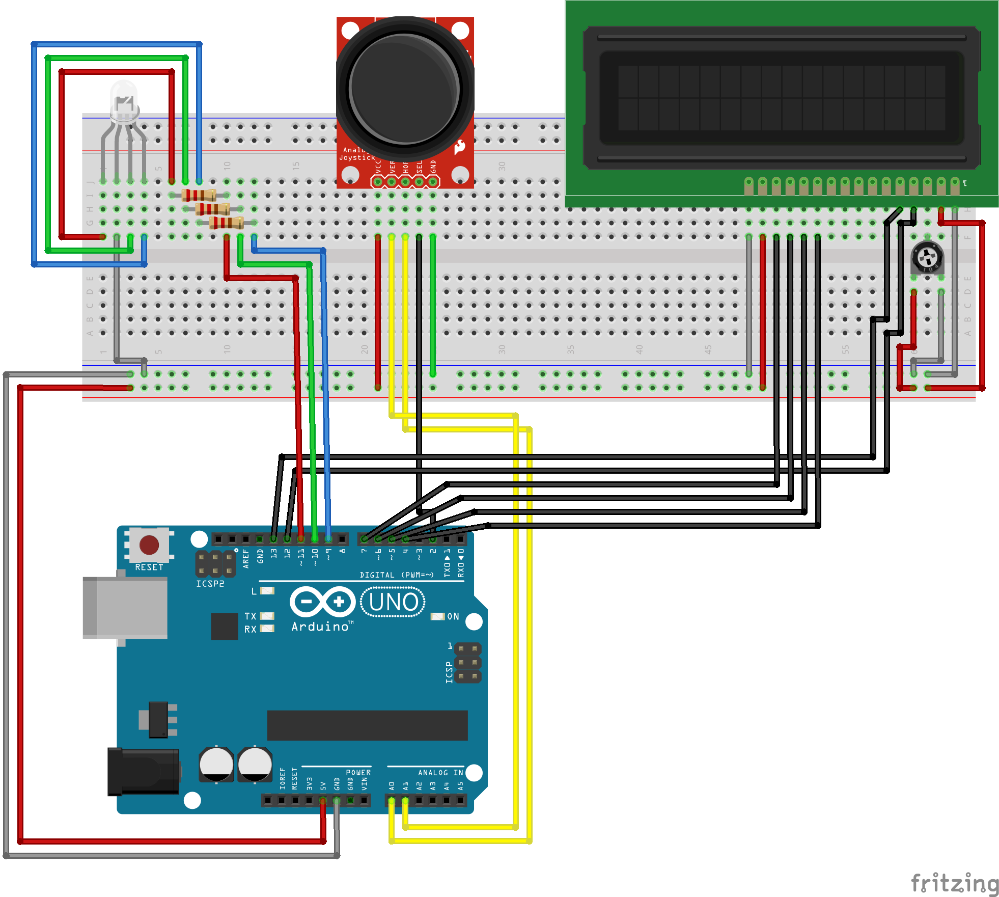

Color-Picker
============

Uses an Arduino joystick device, LCD screen, and an RGBLED to display a certain color on LED and its HEX value on the LCD screen

Parts
-----
- Various sizes and colors of male-to-male wires
- Arduino UNO
- RGB LED (Common Cathode)
- 3 220Ω resistors
- Analog Thumb Joystick
- (16x2) LCD Screen
- Trimmer Potentiometer 10KΩ
- Breadboard

Wiring
------
Most of this can be understood by looking at the code and the initializations of the objects. The only restrictions about this circuit is that the directions on the joystick need to go the the analog pings. The RGB LEDs need to go to PWM enabled pins (these are the digital pins that have a ~ next to the number). The resistors need to be series with the pins for with the R, G, and B pins and their decided digital ports. The power that goes to this circuit must be 5V. Everything else can be deduced by the image provided above. For further facility, the wires have been color coded as follows:
- Grey: GND
- Yellow: Analog
- Red, Green, Blue: Digital pins that correspond to their channel colors for the RGB LED
- Black: Digital Pins
- Red: VCC
